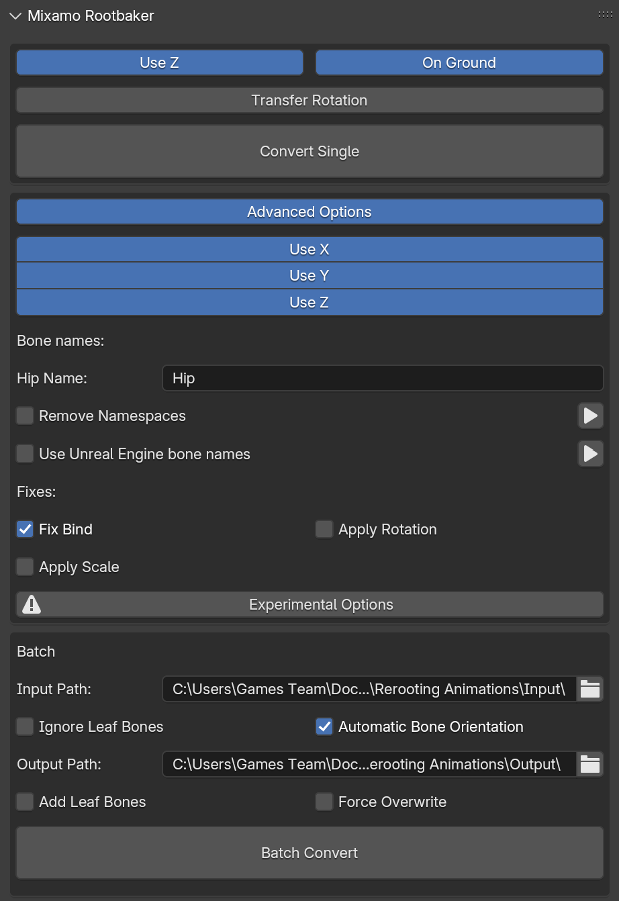

# Importing Animations for the Modular Character

For a majority of the animations on the modular character, we use [Mixamo](https://www.mixamo.com/#/). In order to import animations into Maya for exporting, follow these instructions.

## Step 1: Getting the Character Into Mixamo

To get the character into Mixamo, upload the FBX file for the base Modular Character. The FBX file can be found in this repository in the [Assets folder](https://github.com/LimbitlessSolutionsInc/BashMinigameResources/tree/main/Assets).

Mixamo will prompt you to place the position for stuff like the arms and knees. 

After the character is in Mixamo, find the animation you want to export. Tweak the settings as needed.

At this point you should decide whether the animation will need root motion. In essence, this applies to all animations that will be used for player movement. For example: Walking, Running, Swimming, etc. If it does need root motion, then an extra step is required through Blender. 

Additionally, if root motion is required, make sure “In Place” is **unchecked** before you download. Download the animation at 30 fps. (If you do not need root motion, skip to Step 3.)

## 

## Step 2: Changing Root Motion

Before starting, you will need the blender addon called Mixamo Converter.   
It can be found at: [https://github.com/enziop/mixamo\_converter](https://github.com/enziop/mixamo_converter). Download the ZIP file and install the plugin into Blender. [https://docs.blender.org/manual/en/latest/editors/preferences/addons.html\#add-ons](https://docs.blender.org/manual/en/latest/editors/preferences/addons.html#add-ons)

Open Blender, and then press N to open the side panel. Click on Mixamo, and copy these settings exactly aside from the input and output paths:  

This will correct the animations, and are now ready to import into Maya.

## Step 3: Importing Into Maya

Once your animation is ready, import and then open the Modular Character Mixamo Rig in maya. (Not the one you just downloaded, at least not yet.)

Now that the rig is open, drag and drop the FBX file into the Maya viewport. It should replace the character’s default animation with the new one. This works because it is matching the joints from the new animation to the existing joints for the base file since they share the same names.

It is also worth noting that if you would like to make custom animations, then you will need to use a custom control rig. Animations from Mixamo will not work with a modified rig because those work on a joint level instead of a controller level.
