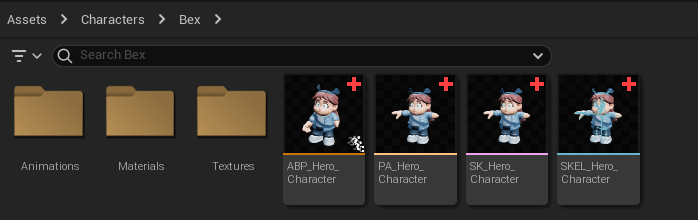

## 

## Minigame Asset Guide

Contents

> 1. [Important Information](#important-information)  
> 1. [Importing](#importing)  
> 1. [Naming Conventions](#naming-conventions)  
> 1. [Folder Structure](#folder-structure)  
> 1. [/Asset/](#asset)  
>    5.1 [/3rdParty/](#3rdparty)  
## Important Information

When importing assets into an Unreal Game, the engine makes a *copy *of the source file. It does **not **actually import the original file. To rectify this, Bionic Bash Minigames should contain 2 Asset Folders. **There should be 1 asset folder inside the Content directory, and 1 asset folder inside the project root directory.** These should be exact mirrors of each other. The one inside the content directory should contain** UASSETS**, and the one in root should contain the **original source files**(fbxs, pngs, etc). This does **not **include files like “.mb, .ma, .blender”. Those will not be kept inside of the project or source control. 

For the sake of understanding, for the rest of the guide, the asset folder inside the content directory will be known as the **UASSET **folder and the one inside root will be known as the **SOURCE ASSET** folder. If a rule applies to both folders, it will be made in reference to the **ASSET **or **ROOT ASSET **folder.

The *SOURCE ASSET *and *UASSET *folder should be an **exact **mirror. This makes it easy to find and make changes to the original files.

*IE:*

- SOURCE ASSET/

	- Cannon/

		- Materials/

		- Textures/

		- Cannon.fbx

	- Cannonball/

		- Materials/

		- Textures/

		- Cannonball.fbx

- Content/

	- UASSET/

		- Cannon/

			- Materials/

			- Textures/

			- Cannon.uasset

		- Cannonball/

			- Materials/

			- Textures/

			- Cannonball.uasset

## Importing

Before importing a specific source file, put the file inside the appropriate SOURCE ASSET directory. Afterwards import the file into the UASSET folder at the same appropriate location.

When importing a model, make sure to set its default material to its material in the mesh editor.

Avoid importing unnecessary materials or models like duplicates or default materials maya and blender create.

Imported models should have proper scaling and a reasonable origin. The origin should be placed in a location that makes it easy to drag and drop in the editor.

## Naming Conventions

Folders will use PascalCase. The first letter of every word is capitalized. Do not include spaces or underscores.

Source Assets will have their usual names. Take care to name things specifically. Do not import materials or textures named “StandardSurface” or variations on that.

UAsset naming will follow [Unreal’s official name guidelines.](https://dev.epicgames.com/documentation/en-us/unreal-engine/recommended-asset-naming-conventions-in-unreal-engine-projects) This involves a capitalized prefix for every file. After the capitalized prefix, the name itself should be PascalCased.

## Folder Structure

In general, a Bionic Bash Minigame’s folder structure works to group related things together. For example a folder for a specific prop might look something like this:

- /Hammer/

	- /Materials/

	- /Textures/

	- SM_Hammer

Materials specific to a model will be found inside a Materials folder in the same directory as the model. Textures specific to that model will be found in a Textures folder found in the same directory as the model. Very similar models will be found in the same directory.

*IE:*

- Environment/

	- Rocks/

		- /Materials/

		- /Textures/

		- SM_Rock1

		- SM_Rock2

		- SM_Rock3

Materials and textures shared by many different models will be stored in the closest SharedMaterial folder that is a sibling to folders that encapsulate all the models that use those resources.

*IE:*

- Assets/

	- Environment/

		- Rock/

			- SM_Rock1

	- Structures/

		- Rockwall/

			- SM_RockWall

	- SharedMaterials/

		- Rock/

			- M_Rock

If a folder begins to have too many direct children, consider separating the children into thoughtful subfolders.

Below is an example of a properly organized character.

### /Asset/

The Root Asset folder will only contain folders. Do not put assets directly in the root asset folder.

#### /3rdParty/

If your minigame contains third party assets like an asset pack, please place them inside a directory named “3rdParty” within the asset folder, as well as any related copyright licenses.
