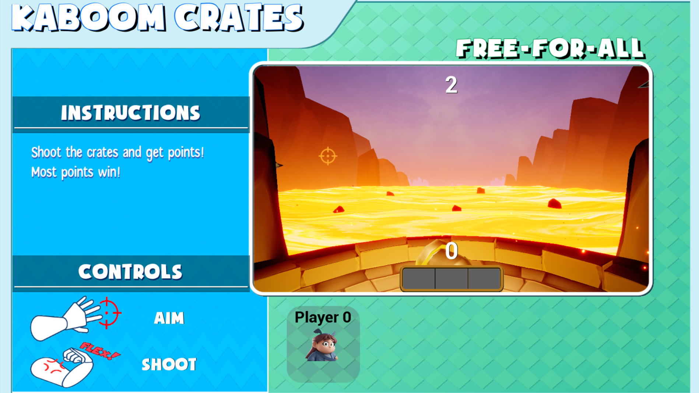

# 

# MinigameCore

## Requirements

MinigameCore requires an installation of Unreal Engine 5.1 on a Windows operating system.

A basic understanding of Unreal Engine 5 is strongly recommended.

For use in Super Bionic Bash, minigames must be hosted in a public GitHub repository with an MIT license.

When creating the repository with GitHub, select "MIT License" from the dropdown to generate an MIT license.


## Sample Project

Here is a sample project that uses MinigameCore. Feel free to reference it to see the plugin's features and structure in use: https://github.com/LimbitlessSolutionsInc/BashMinigameSample

## Table of Contents
> 1. [Getting Started](#1-getting-started)  
> 1. [Minigame Base](#2-minigame-base)  
>    2.1 [Creating a minigame with MinigameBase](#21-creating-a-minigame-with-minigamebase)  
>    2.2 [Practice Mode](#22-practice-mode)  
>    2.3 [Minigame Base Settings](#23-minigame-base-settings)  
>    2.4 [AMinigameBase Member Functions](#24-aminigamebase-member-functions)  
>    2.5 [Events & Delegates](#25-events-&-delegates)  
>    2.6 [Player Spawning](#26-player-spawning)  
>    2.7 [Resetting](#27-resetting)  
> 1. [Minigame Player](#3-minigame-player)  
>    3.1 [Player Input](#31-player-input)  
> 1. [Minigame Captures](#4-minigame-captures)  
>    4.1 [Splitscreen](#41-splitscreen)  
> 1. [Point Counting](#5-point-counting)  
> 1. [Minigame UI](#6-minigame-ui)  
> 1. [Player Rotation Component](#7-player-rotation-component)  
> 1. [Player Acceleration Component](#8-player-acceleration-component)  
> 1. [Editor Tools](#9-editor-tools)  
> 1. [Asset Organization Conventions](#10-asset-organization-conventions)  
> 1. [Minigame Design Pillars](#11-minigame-design-pillars)
> 1. [Minigame Migration](#12-minigame-migration)  
>    11.1 [Migrating C++](#121-migrating-cpp)  
>    11.2 [Migrating Assets](#122-migrating-assets)  
> 1. [Disclaimer and Licensing](#13-disclaimer-and-licensing)

# 1. Getting Started

This documentation assumes an understanding of Unreal Engine 5 basics, such as familiarity with blueprints, actors, and gamemodes. C++ knowledge is **not** required.

To get started with making your new minigame:

1. Create a new Unreal Engine 5.1 project with the same name as your minigame

2. Create a folder called Plugins in the root folder of your newly created project. Download the Plugins folder from this GitHub repository and place its contents into the newly created project Plugins folder. Enable MinigameCore in the editor (Edit > Plugins > Search for **MinigameCore** > Select checkbox)


3. If you don’t see the Plugins content folder in your content browser, click on Settings in the top-right corner of the Content Browser and select “Show Plugin Content”.


4. If creating your minigame in C++, ensure the Unreal module depends on the plugins. In **[MinigameName].Build.cs**, add **“MinigameCore”** and **“BashCore”** to your **PublicDependencyModules**. 

Example:

```c#
public class MyMinigame : ModuleRules
{	
	public MyMinigame(ReadOnlyTargetRules Target) : base(Target)
	{		
		PublicDependencyModuleNames.AddRange(			
			new string[]
			{			
				"Core",
				"MinigameCore",
				"BashCore"
			}
		);
	}
}

```

6. Set the local player for your project. Navigate to Edit > Project Settings > Engine > General Settings > Default Classes > Local Player Class. Alternatively, search “Local Player” in the Project Settings search bar, then scroll down to “Local Player Class”. Select **BashLocalPlayer** from the dropdown. Restart the editor.


7. Create a new level (File > New Level). This level should have the same name as your minigame.


8. Create a minigame player, either in C++ or Blueprint, deriving from **AMinigamePlayer**. Name this player **BP_[Minigame Name]Player**. Replace [Minigame Name] with the name of your minigame or an initialism. 

To create from Blueprint, right click in the Content Browser and select Blueprint Class > All Classes > Search “MinigamePlayer”.

To create from C++, go to Tools (in the top toolbar) > New C++ Class > All Classes > Search for “MinigamePlayer”


9. Create a new GameMode Blueprint derived from **BP_MinigameBase** (similar to step 8 with MinigamePlayer). Name this Minigame Base as **BP_[Minigame Name]Gamemode**. Replace [Minigame Name] with the name of your minigame or an initialism. Open the Blueprint and fill the settings in the Details pane (see [2.3 Minigame Base Settings](#23-minigame-base-settings)) with information about your minigame.


10. Set the GameMode override in the level to the newly created minigame GameMode.

11. Add a **BP_MinigameCapture** object to the world (or multiple if using [Splitscreen](#62-splitscreen)). Do this by **dragging it out** from the MinigameCore content folder - do **not** make your own Blueprint. Default Unreal camera actors will not work. See [4. Minigame Captures](#4-minigame-captures). 

12. Add **BP_MinigamePlayerSpawn** objects to the world and populate their fields. Do this by **dragging it out** from the MinigameCore content folder - do **not** make your own Blueprint. Players will spawn at these player spawn locations. Default Unreal PlayerStarts will not work. See [2.6 Player Spawning](#26-player-spawning).

At this point, the minigame is ready to integrate with the rest of the system. The rest of the minigame may be implemented.

# 2 Minigame Base

The minigame base is a GameMode class that handles most of the common functionality of minigames. Create a new Blueprint class derived from MinigameBase for each minigame to add more specific behavior and set important information about your minigame.

To create a GameMode derived from MinigameBase, right click in the Content Browser, select “Blueprint Class”, then search for “BP_MinigameBase”. Select BP_MinigameBase and then click “Select” to create the new GameMode.


## 2.1 Creating a minigame with MinigameBase

When making a minigame, much of the game logic should be in the level’s GameMode. The GameMode should inherit from the **BP_MinigameBase** to make use of common minigame functionality. It is also possible to create your minigame by inheriting from **AMinigameBase** in C++, although it is recommended to derive from Blueprint if possible. However, this will require setting additional fields that **BP_MinigameBase** provides (see [2.3 Minigame Base Settings](#23-minigame-base-settings)).

The blueprint GameMode used for your minigame should follow the naming convention of: **BP_[Minigame Name]Gamemode**, where [Minigame Name] is replaced with the name of your minigame or an initialism. 

If deriving from AMinigameBase in C++, name the class **[Minigame Name]Gamemode**, where [Minigame Name] is replaced with the name of your minigame or an initialism. The respective header and source file should have the same name. 

## 2.2 Practice Mode

When transitioning into a minigame from the board, it will start in the Practice Mode phase. During this phase, important information like the game controls and game objective is displayed on the screen. Players will be able to play the game during this time to learn how to play, but the results are not considered for rewards. While in Practice Mode, the game will continue to reset. PracticeMode will end once all players are ready by pressing the Ready Up action button.

Practice Mode uses the same level. All of this is handled by the Minigame Base by default.

To comply with the Practice Mode phase reset, ensure that your GameMode and any Actors implement OnReset, if applicable, (see [2.7 Resetting](#27-resetting)) and that you have filled in all the fields in the Practice category (see [2.3 Minigame Base Settings](#23-minigame-base-settings)).

Example of Practice Mode



## 2.3 Minigame Base Settings

GameMode blueprints derived from **BP_MinigameBase** or **AMinigameBase** will have several fields in the Details pane that set important aspects of the minigame.

| Member | Data Type | Description |
|---|---|---|
| <strong>Settings</strong>  |
| Player Objects | TArray<TSubclassOf\> | The class that each player will be spawned in as. The array is indexed by team number.  |
| Team Type | EMinigameType | Determines the team split of the minigame. Options are free-for-all, 3-against-1, and 2-against-2 |
| Minigame Duration | float | Duration of the minigame until the game is ended. In Practice Mode, the minigame will automatically reset after this duration. |
| Level Sequence | ULevelSequence | An optional level sequence that will be played after all players ready up in Practice Mode. |
| <strong>Practice</strong> |
| Minigame Name | FString | The name of the minigame that will be displayed in Practice Mode |
| Description | FString | The description of the minigame that will be displayed in Practice Mode. This should explain important details such as game objectives, potential hazards, etc. |
| Controls | TArray<FControlDisplay> | An array of Image-String pairs. Each image should be an icon that corresponds with a controller button or type of input. The string should be what that button or input does (e.g. “Jump”, “Attack”, etc.) |
| ResetDelay | float | The amount of time between the game ending and resetting for the screen wipe effect to play.  |
| <strong>UI   |
| Practice UI Class | TSubclassOf<UPracticeModeUI> | The class of widget to display during Practice Mode. Set automatically when deriving from BP_MinigameBase. If deriving from C++, this needs to be set manually. |
| Minigame UI Class | TSubclassOf<UMinigameUI> | The class of widget specific to the minigame. See Minigame UI. |
| End UI Class | TSubclassOf<UUserWidget> | The class of widget that is spawned when the minigame is over. WBP_MinigameFinish may be used for this. Set automatically when deriving from BP_MinigameBase. If deriving from C++, this needs to be set manually. |
| <strong> Splitscreen (see Splitscreen)  |
| SplitBy | ESplitBy | Determines how the screen should be split if UseSplitscreen is true. Can be split either by number of players or by number of teams. |
| bUseSplitscreen | boolean | Indicates whether this minigame uses splitscreen or not. HIGHLY RECOMMENDED to keep this false unless it is very cheap to render your minigame! |
| Splitscreen UI Classes | TArray<TSubclassOf<USplitscreenUI>> | The classes of widgets that will be used for each number of splits. Index 0 is for 1 split, Index 1 is for 2 splits, etc. Currently, even if splitscreen is not used, index 0 must always be set. Set automatically when deriving from BP_MinigameBase. If deriving from C++, this needs to be set manually. |

## 2.4 AMinigameBase Member Functions

The GameMode also provides several helpful functions to access information and control minigame state

| Member Function | Description |
|---|---|
| float GetTimeElapsed() | Returns the amount of time since the minigame started. This amount is reset when the minigame is reset. |
| float GetTimeRemaining() | Returns the amount of time remaining until the minigame automatically ends |
| void SetTimeRemaining(float) | Sets the amount of time until the minigame ends |
| int GetInstanceNumPlayers() | Gets the number of players in the minigame. |
| bool IsPractice() | Returns true if the minigame is in practice mode |
| bool IsInProgress() | Returns true if the minigame is not in progress (i.e. EndGame has not been called, time hasn’t ran out, etc.) |
| void EndGame()
 | Ends the minigame early. Has no effect if the minigame is already ending. |
| AMinigameCapture* GetCamera(int) | Returns the minigame camera assigned to the associated player number. |
| AMinigamePlayer* GetPlayer(int) | Returns a pointer to the player associated with the player number |

## 2.5 Events & Delegates

**AMinigameBase** provides several delegates that trigger on key parts of a minigame’s lifetime.

OnGameStart - triggered after players are spawned and the minigame is fully initialized. This is called after a minigame has finished resetting.

OnGameEnd - triggered when the minigame is ended, either due to the timer or EndGame().

OnGameReset - triggered right before the minigame is reset

OnPracticeModeEnd - triggered when all players have readied up. Ending practice mode also ends the game and resets the game.

## 2.6 Player Spawning

Player objects will automatically be spawned and assigned to their controllers **AMinigameBase** depending on the value of Team Type and Player Classes. 

Each player class should be a subclass of **AMinigamePlayer** (see [3. Minigame Player](#3-minigame-player)).

The spawn locations will be determined by PlayerSpawns (a BP_MinigamePlayerSpawn Actor or any Actor deriving from **APlayerSpawn**). PlayerSpawns will have four properties:

- Team - The team number associated with the player spawn (starting from 0). Players can only spawn at player spawns with the same team as them.

- Position - Decides which player on the team will spawn where. The first player on the team will spawn at position 0, the second player on the team will spawn at position 1, etc. This is team specific, so all teams’ first player spawns will have Position set to 0.

- NumPlayersRequired - the number of players required to be in the minigame for this player spawn to be used. For example, if this is set to 2, the player spawn will only be used if there are 2 players in the game. However, this player spawn will NOT be used if 1, 3, or 4 players are in the game. Helpful when positioning players to fill up available space depending on number of players, etc.

- bUseOnAnyPlayerCount - If true, this player spawn is used regardless of player count, ignoring NumPlayersRequired. Select this if you don’t need varied spawn locations based on player count.

Note that **APlayerSpawn** is different from Unreal Engine’s builtin Player Start. Using APlayerStart will not function properly.  

In 3v1, the team with 3 players will be Team 0. The team with 1 player is Team 1.

In FFA, all Player Starts should be set for Team 0. The Position will decide spawn placement and should range from 0-3.

If two player spawns have the same player count, team, and position, only one will be used. A warning will be printed to the screen in these scenarios.

## 2.7 Resetting

To support Practice Mode’s requirement to play the minigame several times without reloading the level, minigames must be able to reset.

The “OnReset” blueprint event should be used on the GameMode and Actors to clean up and reset any values that should not be carried over to the next playthrough, or delete actors that are spawned during the minigame.

Default functionality like points, timers, and MinigameBase properties will automatically be reset and ready to use for the next playthrough. MinigamePlayers spawned through the MinigameBase will also be automatically reset.

Custom actors or properties on a MinigameBase subclass must manually be reset. 


Basic example that destroys an actor that was dynamically spawned over the course of the level.

# 3 Minigame Player

All minigame player pawns should be derived from **AMinigamePlayer**.

Blueprint subclasses of minigame players need to specify the input mapping context and the ready input action in the details pane. This should be set to **IMC_Minigame** and **IA_PracticeReadyUp**, which are included with MinigameCore.


Here are some helpful properties available to MinigamePlayers:

| Member | Description |
|---|---|
| AMinigameBase* Minigame | A pointer to the current minigame gamemode. |
| int Team | The team this player is on. |
| int PlayerNumber | A unique identifier for this player, from 0-4. This can be used with the minigame base to get/set points, get a reference to the player, etc. |

## 3.1 Player Input

Players inheriting from **AMinigamePlayer** will automatically be bound to the **IMC_Minigame** Input Context that is passed into it through the details pane. The following input actions in IMC_Minigame may be used as input for the minigame:

| Input Action | Description |
|---|---|
| IA_Movement| 2D vector from controller directional pad, thumbstick, or keyboard WASD |
| IA_Button[1-4] | Controller’s various action buttons |
| IA_AnalogFlex | Floating point value ranging from 0* to 1 that represents the current flex value of the player. 0 corresponds to the rest threshold, 1 corresponds to maximum flex reading. This value can be negative if the read value is less than the calibrated rest threshold. 
| IA_LightFlex, IA_MediumFlex, IA_StrongFlex | Input actions that are triggered when a discrete flex is detected. Discrete flex intensity is measured by the peak value reached during a flex.
| IA_Rotation | The current rotation of the player’s flex device, in Euler angles, from the device’s calibration point. Recommended to use the **[Player Rotation Component](#7-player-rotation-component)** instead. |
| IA_Acceleration | The proper acceleration of the player’s device. Note that proper acceleration includes the force counteracting gravity, if any. Recommended to use **[Player Acceleration Component](#8-player-acceleration-component)** instead. |

Example of IA_MediumFlex and IA_StrongFlex in use


The value of IA_Rotation and IA_Acceleration can be read from Blueprints using an Enhanced Input Value node (simply search for IA_Rotation or IA_Acceleration in the graph). The value of IA_Rotation and IA_Acceleration can be read in C++ through the MinigamePlayer’s Input Subsystem.

In Blueprint,


In C++,
```cpp
if (APlayerController* PC = Cast<APlayerController>(GetController())
{	
	UEnhancedInputLocalPlayerSubsystem* InputSubsystem = 
		PC->GetLocalPlayer()->GetSubsystem<UEnhancedInputLocalPlayerSubsystem>();

	if (InputSubsystem)
	{
		Vector3 Rotation = InputSubsystem->GetPlayerInput()->GetActionValue(RotationInputAction).Get<FVector>();
	}
}
```
In this case, RotationInputAction is a member variable of type TObjectPtr<UInputAction> that has been assigned to IA_Rotation in the Details pane.

# 4 Minigame Captures

The minigame capture is an actor in the world that acts like a camera. Default Unreal cameras will NOT work with minigames.

Set the minigame capture instance’s Capture Number property to specify which split of the screen it should be associated with.

For example, this minigame capture has capture number 0. This capture will be assigned to the first split in splitscreen games, or be the main camera in non-splitscreen games.


If the minigame does not use splitscreen, only the first minigame capture (capture number = 0) will ever be used. 

If a minigame capture is assigned to a split that is not used (i.e. in a split-by player minigame that only has three players), the minigame capture will automatically be disabled.

## 4.1 Splitscreen

If AMinigameBase’s bUseSplitscreen is **true**, then several views of the game will be displayed. Each view will be assigned a different instance of the minigame UI and a different minigame capture. As such, splitscreen minigames require multiple minigame captures to be placed.

A splitscreen minigame can be split either by player or by team. If split by player, each player will have its own split of the screen with its own minigame UI and its own minigame capture. If split by team, each team will share this split.

The minigame capture associated with a specific player’s view can be retrieved via [GetCamera() on AMinigameBase](#24-aminigamebase-member-functions).

Enabling splitscreen requires rendering the level multiple times and, as such, is ***very expensive***. Splitscreen minigame levels should be simple and fast to render. Use caution when enabling splitscreen.

# 5. Point Counting

The Point Counter is an actor component attached to minigame game modes that handle all of the scorekeeping and result calculations. MinigameCore provides BasePointCounter with a basic implementation, but developers may create a point counter deriving from **UBasePointCounter** to customize behavior.

A point counter **must** be registered with the GameMode and used to keep track of points. This is how minigame results is reported back to the board. Using a different scorekeeping system will prevent the minigame from properly interfacing with the rest of Super Bionic Bash.

If a point counter is not provided in the GameMode blueprint, a UBasePointCounter will be created at runtime.

Point counters keep score based on teams. In free-for-all minigames, the player number is used as the team number instead.

UBasePointCounter provides the following member functions, all of which may be overridden in child classes for customization. In most cases, customization is not necessary.

| Member Function | Description |
|---|---|
| void AddPoints(int Team, int Amount) | Adds points to the team’s score.  |
| void SetPoints(int Team, int Amount) | Sets a team's point counter to the amount. |
| int GetPoints(int Team) const | Returns the current number of points of a team. |
| int GetPointsByPlayer(int Player) const | Returns the current number of points of a player (see Minigame Player). |
| TArray<FMinigameStanding> GetStandings() const | Gets the results of the minigame based on the current score. Automatically called by Minigame Base when the minigame ends. |
| void InitializePointCounter(int NumTeams, TArray<int> TeamAssignment) | Initializes point counter with team information. TeamAssignment is given as an array where index is player number and element is team number. |

Point counters also have a dynamic multicast delegate, OnPointsChanged, that is triggered when the point counter’s score changes. OnPointsChanged provides the team number of the affected team and the new point count.

Example of adding points when a target is hit by a projectile


# 6 Minigame UI

AMinigameBase’s MinigameUIClass property only accepts widgets inheriting from **UMinigameUI**. 

This class is automatically instantiated and displayed when the minigame starts. You do **not** need to manually spawn your widget and add it to viewport.

To get started, create a widget Blueprint that inherits from **UMinigameUI**. Then, set the **Minigame UI** class in the Minigame GameMode to the newly created class. 


**UMinigameUI** has the following members:

| Member | Description |
|---|---|
| AMinigameBase* Minigame | A pointer to the minigame base that spawned the minigame UI. |
| int AssignedSplit | An integer signifying which split this minigame UI is displayed in a splitscreen game (see Splitscreen). In non-splitscreen games, this will always be 0. |
| void StartUI() | A BlueprintNativeEvent that triggers when the minigame UI is spawned by the gamemode. This is triggered after Minigame and AssignedSplit have been set. If these are needed, use this rather than Event OnConstruct. |

The minigame UI can be used for displaying helpful information such as team score and minigame duration.

To access properties or functions of a derived GameMode, simply cast the widget’s Minigame reference to the type of your minigame’s GameMode.

# 7 Player Rotation Component

**UPlayerRotationComponent** is an actor component that is included with MinigameCore. It simplifies the use of raw rotation input (IA_Rotation) and offers convenient functionality for interpreting and processing rotation data in gameplay scenarios. Minigames that use rotation should have this component on its MinigamePlayer subclass. 

If more specialized or low-level control is needed, developers can use IA_Rotation directly without the use of the component.

**Member Functions:**

void ResetInitialOrientation() - resets the “starting point” rotation to the current orientation and recenters aim. Useful for resetting the effects of drift along the Z-axis or after repositioning the device on the arm.

FQuat GetDeltaRotation() const - returns a quaternion representing the rotation from the set initial orientation to the current orientation.

FVector2D GetAimPosition() const - gets the screen space position of the aimed position. Good for rendering a crosshair on the screen

FVector GetDirectionFromCamera(FQuat CameraOrientation) const - gets a direction from the camera to the aimed position in global worldspace. Good for raycasting to where a crosshair is aiming.

FQuat GetRotationInputValue() const - returns a quaternion representation of IA_Rotation’s value.

Here’s an example which uses a UPlayerRotationComponent to cast a ray in the direction of where the player’s flex device is aiming

```cpp
void ATestMinigamePlayer::CastRay()`
{
	AMinigameCapture* Capture = Minigame->GetCamera(PlayerNumber);
	FVector RaycastEnd = RotationComponent->GetDirectionFromCamera(Capture->GetActorQuat());
	FHitResult Res{};
	if(GetWorld()->LineTraceSingleByChannel(Res, Capture->GetActorLocation(), RaycastEnd, ECollisionChannel::ECC_Visibility)
	{	
		// Hit something!
	}
}
```
# 8 Player Acceleration Component

**UPlayerAccelerationComponent **is an actor component that is included with MinigameCore. It simplifies the use of raw acceleration input (IA_Acceleration) and offers convenient functionality for interpreting and processing acceleration data in gameplay scenarios. Minigames that use acceleration should have this component on its MinigamePlayer subclass. 


This component computes **coordinate acceleration**, which is particularly useful for detecting player movement relative to the game world. In contrast, IA_Acceleration provides **proper acceleration**, measured in a free-falling reference frame. This is useful in physics-based contexts but less intuitive for gameplay logic, which is why coordinate acceleration is preferred.


By default, the **UPlayerAccelerationComponent** cannot reliably distinguish between X- and Y-axis accelerations due to a lack of orientation context. However, it can still differentiate between horizontal (X/Y) and vertical (Z) movement. 


To enable accurate distinction across all three axes (X, Y, and Z) add a **UPlayerRotationComponent** to the player and reset the initial orientation (using UPlayerRotationComponent::ResetInitialOrientation). This provides the necessary reference frame for precise axis-based acceleration tracking.

If more specialized or low-level control is needed, developers can use IA_Acceleration directly without the use of the component.

**Members:**

FVector GetCoordinateAcceleration() const - returns the calculated coordinate acceleration

FVector GetAccelerationInputValue() const - returns the proper acceleration from IA_Acceleration

void ListenForMovement(FEvaluateMovementSignature EvaluateMovement, FOnMovementTriggeredSignature OnMovementTriggered) - adds a movement, as described by EvaluateMovement, to listen for. If this movement is detected, OnMovementTriggered will be executed.

EvaluateMovement is a dynamic delegate that takes one FVector parameter, the coordinate acceleration, and returns a boolean signifying if the movement happened or not.

OnMovementTriggered is a dynamic delegate with no parameters or return value.

Example of ListenForMovement being used in Blueprint:


# 9 Editor Tools

MinigameCore comes with Editor Utility Widgets to make playtesting and debugging easier. All the editor tools are compiled in **MinigameCore Content > Tools > EUW_MinigameCoreEditorTools**. While playing the minigame, right click the widget asset and select “Run Editor Utility Widget”.


**EUW_MinigameCoreEditorTools** has a “Refresh All” button at the top, which refreshes all of the included editor utility widgets. Refreshing the widgets is necessary to show recently connected controllers. 

MinigameCore Tools:

**JoyCon Scanner** - Scans for JoyCon, DualShock, and DualSense devices connected. Only needs to be done once per session

**JoyCon Assigner** - Assigns a connected JoyCon device to a specific Platform User on Unreal Engine.

**Device Scanner** - Start and stop bluetooth scans. Currently, devices can only be connected through the main menu during normal gameplay. Using the Device Scanner is needed to be able to connect devices when starting from a minigame level. 

**Minigame Player Count Helper** - Type the number of players you want to select in the box, then click “Set Player Count”. The minigame level will restart with the desired number of players. 

**Flex Controller Assignment** - Assigns connected flex controllers to players.

**IMU Calibration** - Starts calibrating the IMU for this device. Set the selected device down on a flat surface with the LED up and wait a few seconds for the IMU calibration to complete.

**Flex Calibration** - Starts calibrating the EMG for this device. This includes a period of resting followed by a period of flexing. 

*Note: We intend to add device connection, assignment, and calibration in minigames as normal gameplay features in the future. This is currently only available in the main menu of Super Bionic Bash.*

There is another editor tool that displays various motion sensor information being received by connected devices. This can be found in **LimbitlessBluetoothPlugin Content > Tools > EUW_DeviceValueTool**. While not strictly necessary for minigame creation, it can be occasionally useful. 

# 10 Asset Organization Conventions

All in-editor assets and blueprints should follow the standard Unreal asset naming convention. In general, the naming convention is an initialism of the type of asset followed by an underscore should prefix the name of the asset. For example, blueprints are prefixed BP_, textures are prefixed T_, etc.

Minigame-specific blueprints should additionally include the minigame name (or its initials). For example, for a minigame called “Shooting Range” that has a cannon, the blueprint could be called BP_SRCannon.

For more information on asset conventions, see [the Asset Guide](AssetGuide.md).

# 11 Minigame Design Pillars

* Foster competition, but prioritize fun for all players  
  * Games should not be overly punishing.  
  * Losing should still be somewhat fun.  
* Focus on interaction between players  
* Games should be quick to learn, and playable within a minute.  
  * Simplicity is key  
* Avoid recreations of existing minigames  
  * Do not copy theming and mechanics straight from another minigame, either in bash or from another game.  
* No realistic depictions of violence  
  * Especially no firearms.  
* Enemies can be aggressive but never hateful  
* Avoid controversial content.

# 12 Minigame Migration

This section documents the process to move minigames created in separate projects into the base Super Bionic Bash project. For minigame creators, this section can be ignored.

The project with the minigame will be referred to as the “minigame project”. Super Bionic Bash will be referred to as the “base project”.

## 12.1 Migrating C++

If the minigame project has C++ classes, then:

1. In the base project’s BashMinigames plugin, create a new module with the same name as the minigame project.

2. Move all C++ source and header files from the minigame project’s Source folder to the new BashMinigames module’s Source folder. The .cpp and .h files defining the minigame project game module (of the form [ProjectName].cpp and [ProjectName].h) should NOT be moved.

3. In the newly created BashMinigames module, add MinigameCore as a dependency.

4. Add the new module to the Modules section of BashMinigames’ uplugin file.

5. Build to ensure there are no compilation errors

## 12.2 Migrating Assets

Remaining minigame assets (Blueprints, Levels, Textures, etc) can be migrated using Unreal Engine’s migration system.

1. In the minigame project, navigate to the minigame Level.

2. Right click the level in the content browser. Select Asset Actions > Migrate.

3. Unselect every checkbox except Game. The plugins should not be migrated.

4. Click “OK” and navigate to the base project. Navigate to the BashMinigames Content folder and select the folder for migration.

5. Open the base project and ensure the newly migrated assets are in their own subfolder within the Content folder, if it isn’t already. The subfolder should have the same name as the minigame. Fix up any redirectors from this move, if necessary

## 13 Disclaimer and Licensing

University of Central Florida Research Foundation, Inc., d/b/a Limbitless Solutions, Inc. (Limbitless or LSI), located at the University of Central Florida (University) in Orlando, Florida, United States of America received support to host a game-jam. This project was funded [in part] by a grant from the United States Department of State. The opinions, findings and conclusions stated herein are those of the author[s] and do not  necessarily reflect those of the United States Department of State or the University of Central Florida. 

These files are provided for the consideration of Limbitless Solutions to use in Super Bionic Bash or other derivative works related to the future games supporting the training games supporting the Limbitless mission through the MIT license on GitHub.